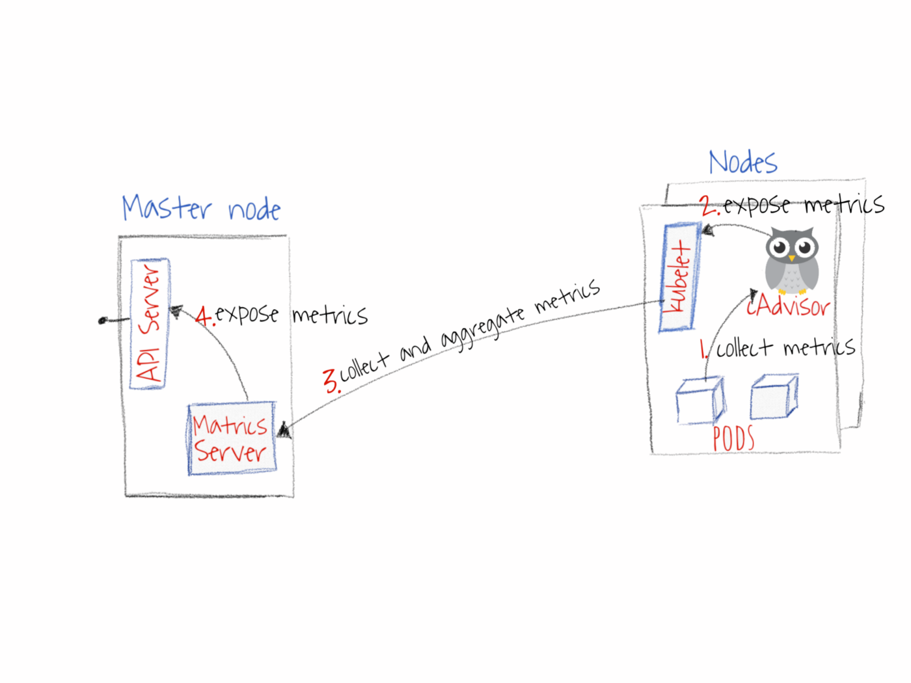

### 1. Install Metric Server
https://artifacthub.io/packages/helm/metrics-server/metrics-server

```shell
helm repo add metrics-server https://kubernetes-sigs.github.io/metrics-server/
helm upgrade --install metrics-server metrics-server/metrics-server
```

### 2. How Metric Server works



1. cAdvisor collect metrics.
2. Kubelet expose metrics for Metrics Server.
3. Metrics Server collect and aggregate metrics.
4. Api server expose metrics by aggregate API.