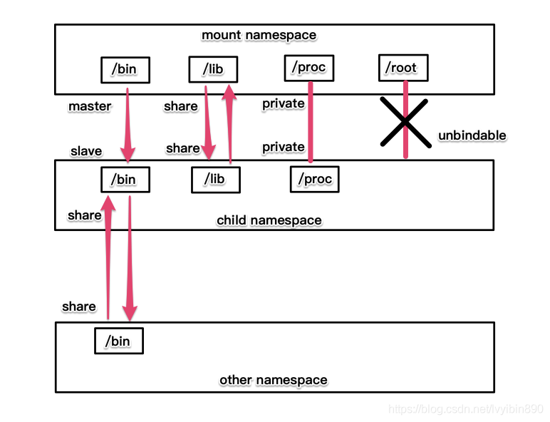
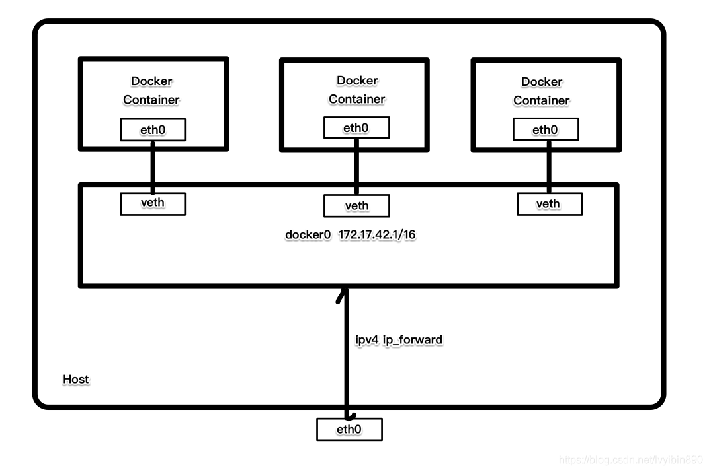

### 在新 network namespace 执行 sleep 指令：

```sh
unshare -fn sleep 60

#### namespace操作：
#### clone（创建进程时，flags指定是否加入其它ns）
#### PROC.setns（调用进程PROC加入到已有namespace）
#### PROC.unshare（调用进程PROC加入新创建一个namespace）
```


### 查看进程信息

```sh
ps -ef|grep sleep
root       32882    4935  0 10:00 pts/0    00:00:00 unshare -fn sleep 60
root       32883   32882  0 10:00 pts/0    00:00:00 sleep 60
```

### 查看网络 Namespace

```sh
lsns -t net
4026532508 net       2 32882 root unassigned                                unshare

# -p, --task pid: Display only the namespaces held by the process with this pid.
# -r, --raw: Use the raw output format.
# -t, --type type: Display  the specified type of namespaces only.  The supported types are mnt, net, ipc, user, pid, uts and cgroup.  This option may be given more than once.

```

### 进入改进程所在 Namespace 查看网络配置，与主机不一致

```sh
nsenter -t 32882 -n ip a
1: lo: <LOOPBACK> mtu 65536 qdisc noop state DOWN group default qlen 1000
link/loopback 00:00:00:00:00:00 brd 00:00:00:00:00:00

-t, --target pid: Specify a target process to get contexts from.  \
    The paths to the contexts specified by pid are:
# /proc/$pid/ns/mnt    the mount namespace
# /proc/$pid/ns/uts    the UTS namespace
# /proc/$pid/ns/ipc    the IPC namespace
# /proc/$pid/ns/net    the network namespace
# /proc/$pid/ns/pid    the PID namespace
# /proc/$pid/ns/user   the user namespace
# /proc/$pid/ns/cgroup the cgroup namespace
# /proc/$pid/root      the root directory
# /proc/$pid/cwd       the working directory respectively

-m, --mount[=file]: Enter the mount namespace.
-u, --uts[=file]: Enter  the UTS namespace.
-i, --ipc[=file]: Enter the IPC namespace.
-n, --net[=file]: Enter  the  network namespace. 
-p, --pid[=file]: Enter the PID namespace.
-U, --user[=file]: Enter  the  user  namespace.
-C, --cgroup[=file]: Enter the cgroup namespace.
```

### namespace隔离效果演示
#### 1. UTS namespace
```shell
mkdir -o /var/lib/nsdemo
cd /var/lib/nsdemo
vim /var/lib/nsdemo/uts.c

```

```cgo
#define _GNU_SOURCE
#include <sys/types.h>
#include <sys/wait.h>
#include <stdio.h>
#include <sched.h>
#include <signal.h>
#include <unistd.h>

#define STACK_SIZE (1024 * 1024)

static char child_stack[STACK_SIZE];
char* const child_args[] = {
        "/bin/bash",
        NULL
};

int child_main(void* args) {
        printf("在子进程中!\n");
        sethostname("NewNamespace",12);
        execv(child_args[0],child_args);
        return 1;
}


int main()
{
        printf("程序开始：\n");
        int child_pid = clone(child_main,child_stack + STACK_SIZE,CLONE_NEWUTS|SIGCHLD,NULL);
        waitpid(child_pid,NULL,0);
        printf("已退出\n");
        return 0;
}
```

```shell
gcc -Wall uts.c -o uts.o && ./uts.o

root@cn-master1:/var/lib/nsdemo# gcc -Wall uts.c -o uts.o && ./uts.o
程序开始:
在子进程中!
root@NewNamespace:/var/lib/nsdemo# exit
exit
已退出
root@cn-master1:/var/lib/nsdemo# 

```
看到主机名已经改变，exit后主机名恢复

#### 2. IPC namespace
#### 进程间通信（Inter-Process Communication，IPC）涉及的IPC资源包括常见的信号量、消息队列和共享内存
#### 在同一个IPC namespace下的进程彼此可见，不同IPC namespace下的进程则互相不可见
```cgo
...
int child_pid = clone(child_main,child_stack + STACK_SIZE,CLONE_NEWIPC|CLONE_NEWUTS|SIGCHLD,NULL);
...
```

```shell
root@cn-master1:/var/lib/nsdemo# ipcmk -Q
Message queue id: 0
root@cn-master1:/var/lib/nsdemo# ipcs -q

------ Message Queues --------
key        msqid      owner      perms      used-bytes   messages    
0xabb7a44f 0          root       644        0            0  

root@cn-master1:/var/lib/nsdemo# gcc -Wall ipc.c -o ipc.o && ./ipc.o
程序开始:
在子进程中!
root@NewNamespace:/var/lib/nsdemo# ipcs -q

------ Message Queues --------
key        msqid      owner      perms      used-bytes   messages    

root@NewNamespace:/var/lib/nsdemo#
```
从结果显示可以发现，子进程找不到原先声明的消息队列了，实现了IPC的隔离

#### 3. PID namespace
```cgo
...
 int child_pid = clone(child_main,child_stack + STACK_SIZE,CLONE_NEWPID|CLONE_NEWIPC|CLONE_NEWUTS|SIGCHLD,NULL);
...

```

```shell
root@cn-master1:/var/lib/nsdemo# gcc -Wall pid.c -o pid.o && ./pid.o
程序开始:
在子进程中!
root@NewNamespace:/var/lib/nsdemo# ps -a
    PID TTY          TIME CMD
 478531 pts/0    00:00:00 uts.o
 478532 pts/0    00:00:00 bash
 487990 pts/0    00:00:00 uts.o
 487991 pts/0    00:00:00 bash
 506826 pts/0    00:00:00 uts.o
 506827 pts/0    00:00:00 bash
 514889 pts/0    00:00:00 bash
 525661 pts/0    00:00:00 bash
 527662 pts/0    00:00:00 bash
1657327 pts/0    00:00:00 pid.o
1657328 pts/0    00:00:00 bash
1658051 pts/0    00:00:00 ps
3425159 tty1     00:00:00 bash
3447434 pts/0    00:00:00 su
3448056 pts/0    00:00:00 bash
root@NewNamespace:/var/lib/nsdemo# mount -t proc proc /proc
root@NewNamespace:/var/lib/nsdemo# ps -a
    PID TTY          TIME CMD
      1 pts/0    00:00:00 bash
     10 pts/0    00:00:00 ps
root@NewNamespace:/var/lib/nsdemo#
```
在新的PID namespace中使用ps命令查看，看到的还是所有进程，因为与pid执行相关的/proc文件系统（procfs）没有挂载到一个与原/proc不同的位置。
如果只想看到PID namespace本身应该看到的进程，需要重新挂载/proc

#### 4. mount namespace

共享挂载（share）
从属挂载（slave）
共享/从属挂载（share and slave）
私有挂载（private）
不可绑定挂载（unbindable）



默认情况下，所有挂载状态都是私有的。

```shell
...
int child_pid = clone(child_main,child_stack + STACK_SIZE,CLONE_NEWNS|CLONE_NEWPID|CLONE_NEWIPC|CLONE_NEWUTS|SIGCHLD,NULL);
...

```

```shell
root@cn-master1:/var/lib/nsdemo# gcc -Wall mnt.c -o mnt.o && ./mnt.o
程序开始:
在子进程中!
root@NewNamespace:/var/lib/nsdemo# mount -t proc proc /proc
root@NewNamespace:/var/lib/nsdemo# ps aux
USER         PID %CPU %MEM    VSZ   RSS TTY      STAT START   TIME COMMAND
root           1  0.0  0.0   7236  4052 pts/0    S    08:44   0:00 /bin/bash
root           9  0.0  0.0   8892  3432 pts/0    R+   08:44   0:00 ps aux
root@NewNamespace:/var/lib/nsdemo# 
```

#### 5. network namespace



```shell
...
int child_pid = clone(child_main,child_stack + STACK_SIZE,CLONE_NEWNET|CLONE_NEWNS|CLONE_NEWPID|CLONE_NEWIPC|CLONE_NEWUTS|SIGCHLD,NULL);
...

```

```shell
root@cn-master1:/var/lib/nsdemo# gcc -Wall net.c -o net.o && ./net.o
程序开始：
在子进程中!
root@NewNamespace:/var/lib/nsdemo# ip add
1: lo: <LOOPBACK> mtu 65536 qdisc noop state DOWN group default qlen 1000
    link/loopback 00:00:00:00:00:00 brd 00:00:00:00:00:00
root@NewNamespace:/var/lib/nsdemo# exit
exit
已退出
root@cn-master1:/var/lib/nsdemo# ip add
1: lo: <LOOPBACK,UP,LOWER_UP> mtu 65536 qdisc noqueue state UNKNOWN group default qlen 1000
    link/loopback 00:00:00:00:00:00 brd 00:00:00:00:00:00
    inet 127.0.0.1/8 scope host lo
       valid_lft forever preferred_lft forever
    inet6 ::1/128 scope host 
       valid_lft forever preferred_lft forever
2: ens18: <BROADCAST,MULTICAST,UP,LOWER_UP> mtu 1500 qdisc mq state UP group default qlen 1000
    link/ether fe:fc:fe:b1:f4:48 brd ff:ff:ff:ff:ff:ff
    inet 10.95.102.111/24 brd 10.95.102.255 scope global ens18
       valid_lft forever preferred_lft forever
    inet6 fe80::fcfc:feff:feb1:f448/64 scope link 
       valid_lft forever preferred_lft forever
root@cn-master1:/var/lib/nsdemo#
```
可以看到网络资源已经被隔离起来了

### 5. User namespace

```cgo
#define _GNU_SOURCE
#include <sys/types.h>
#include <sys/capability.h>
#include <sys/wait.h>
#include <stdio.h>
#include <sched.h>
#include <signal.h>
#include <unistd.h>

#define STACK_SIZE (1024 * 1024)

static char child_stack[STACK_SIZE];
char* const child_args[] = {
    "/bin/bash",
    NULL
};

void set_uid_map(pid_t pid,int inside_id,int outside_id,int length) {
    char path[256];
    sprintf(path,"/proc/%d/uid_map",getpid());
    FILE* uid_map = fopen(path,"w");
    fprintf(uid_map,"%d %d %d",inside_id,outside_id,length);
    fclose(uid_map);
}

void set_gid_map(pid_t pid,int inside_id,int outside_id,int length) {
    char path[256];
    sprintf(path,"/proc/%d/gid_map",getpid());
    FILE* uid_map = fopen(path,"w");
    fprintf(uid_map,"%d %d %d",inside_id,outside_id,length);
    fclose(uid_map);
}

int child_main(void* args) {
    printf("在子进程中!\n");
    cap_t caps;
    set_uid_map(getpid(),0,1000,1);
    set_gid_map(getpid(),0,1000,1);
    printf("eUID = %ld; eGID = %ld; ",(long) geteuid,(long) getegid());
    caps = cap_get_proc();
    printf("capabilities: %s\n",cap_to_text(caps,NULL));
    execv(child_args[0],child_args);
    return 1;
}


int main()
{
    printf("程序开始：\n");
    int child_pid = clone(child_main,child_stack + STACK_SIZE,CLONE_NEWUSER|SIGCHLD,NULL);
    waitpid(child_pid,NULL,0);
    printf("已退出\n");
    return 0;
}


```

```shell
poc@cn-master1:~/nsdemo$ id -u
1000
poc@cn-master1:~/nsdemo$ id -g
1000
poc@cn-master1:~/nsdemo$
```

```shell
poc@cn-master1:~/nsdemo$ gcc  user.c -Wall -lcap -o user.o && ./user.o
程序开始:
在子进程中!
eUID = 0; eGID = 0; capabilities: =ep

```