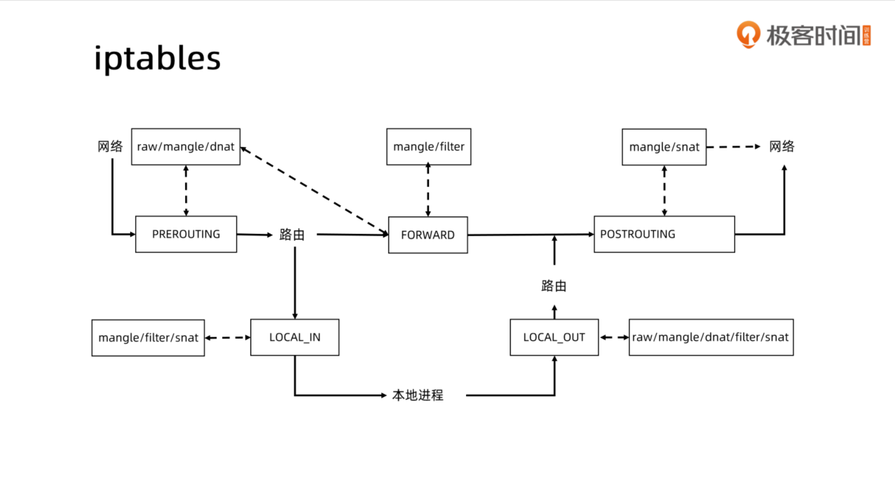
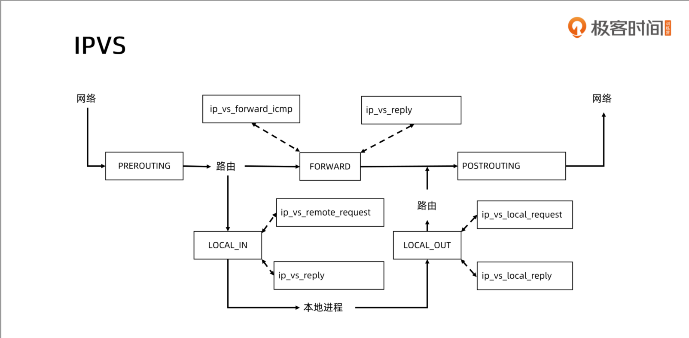

#### 1. install ipvsadm
```shell
sudo apt-get install ipvsadm
```

#### 2. Edit kube-proxy config
```shell
kubectl edit configmap kube-proxy -n kube-system
set mode: "ipvs"
```

#### 3. Restart all kube-proxy pod
```shell
kubectl get po -n kube-system

NAME                                 READY   STATUS    RESTARTS   AGE
coredns-6d8c4cb4d-dlt7c              1/1     Running   2          2d12h
coredns-6d8c4cb4d-hhmd4              1/1     Running   4          34d
etcd-cn-master1                      1/1     Running   4          34d
kube-apiserver-cn-master1            1/1     Running   2          17d
kube-controller-manager-cn-master1   1/1     Running   13         34d
kube-proxy-2qrht                     1/1     Running   0          64m
kube-proxy-sf89b                     1/1     Running   0          64m
kube-scheduler-cn-master1            1/1     Running   12         34d

kubectl get po -n kube-system |grep kube-proxy |awk '{print $1}' |xargs -i kubectl delete po {} -n kube-system
```

#### 4. Flush iptables rules
```shell
iptables --flush
```

#### 5. Verify ipvs rules
```shell
kubectl get svc

NAME         TYPE        CLUSTER-IP       EXTERNAL-IP   PORT(S)    AGE
kubernetes   ClusterIP   10.96.0.1        <none>        443/TCP    34d
mysql        ClusterIP   None             <none>        3306/TCP   2d22h
mysql-read   ClusterIP   10.104.103.147   <none>        3306/TCP   2d22h


kubectl get ep mysql-read

NAME         ENDPOINTS                                                     AGE
mysql-read   192.168.176.20:3306,192.168.176.24:3306,192.168.176.28:3306   2d22h


ipvsadm -L -n |grep -C 5 10.104.103.147
... 
...    
TCP  10.104.103.147:3306 rr
  -> 192.168.176.20:3306          Masq    1      0          0         
  -> 192.168.176.24:3306          Masq    1      0          0         
  -> 192.168.176.28:3306          Masq    1      0          0         
...
...
```

#### 6. iptables & ipvs





