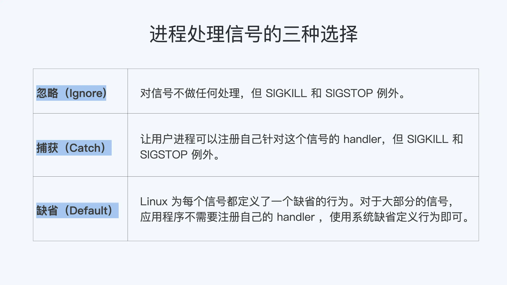
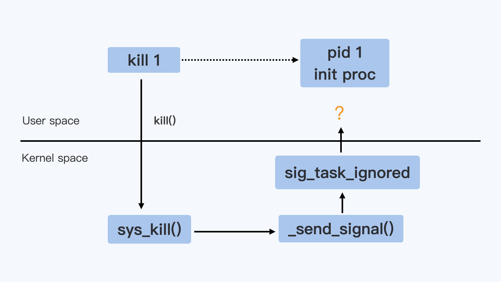
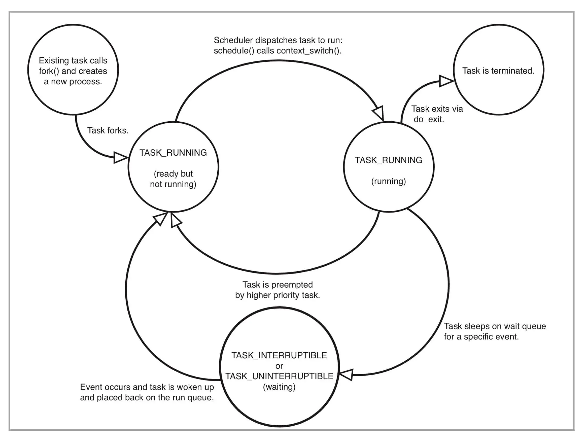
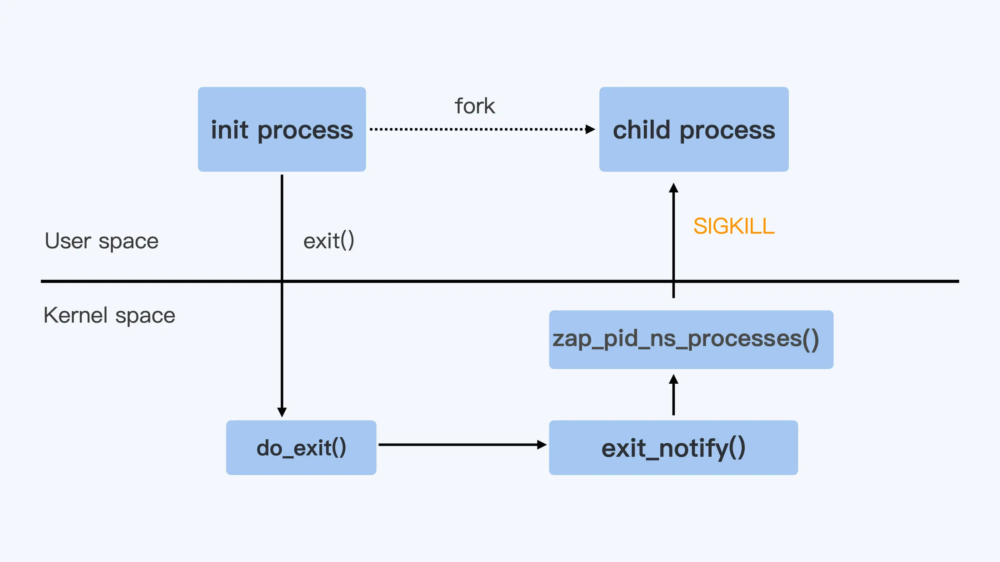
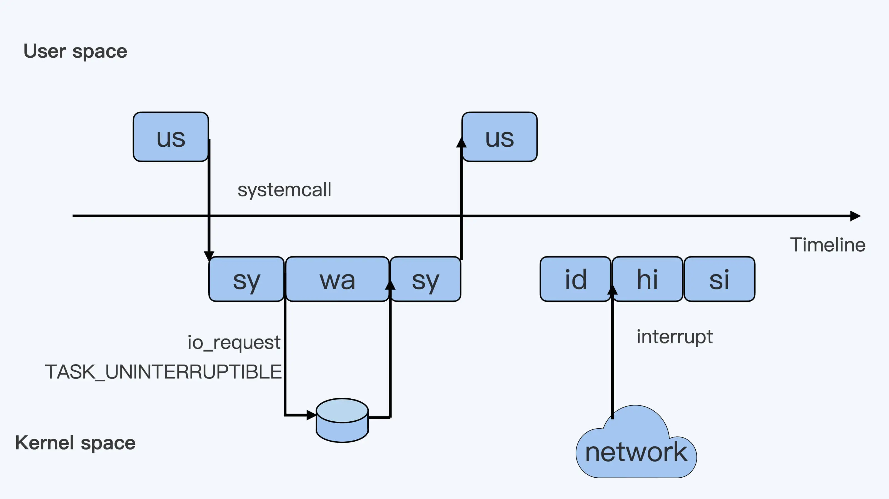
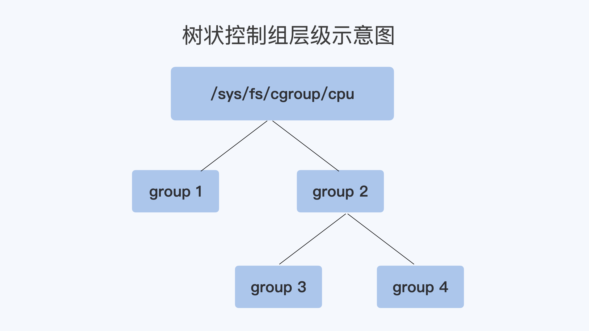

### 理解进程（1）：为什么我在容器中不能kill 1号进程？
#### 1. 安装编译环境（Go 1.17+）
```shell
wget https://go.dev/dl/go1.18.1.linux-amd64.tar.gz
tar -zxvf go1.18.1.linux-amd64.tar.gz
mv go /usr/local/
cat >> ~/.bashrc << EOF
# golang
export GOROOT=/usr/local/go
export PATH=\$PATH:\$GOROOT/bin
export GOPROXY=https://goproxy.cn
EOF
apt install make gcc

```
#### 2. 复现问题

```shell
cd init_proc/handle_sig/
make image
docker stop sig-proc;docker rm sig-proc
docker run --name sig-proc -d registry/sig-proc:v1 /init.sh
docker exec -it sig-proc bash
[root@5cc69036b7b2 /]# ps -ef
UID        PID  PPID  C STIME TTY          TIME CMD
root         1     0  0 07:23 ?        00:00:00 /bin/bash /init.sh
root         8     1  0 07:25 ?        00:00:00 /usr/bin/coreutils --coreutils-prog-shebang=sleep /usr/bin/sleep 100
root         9     0  6 07:27 pts/0    00:00:00 bash
root        22     9  0 07:27 pts/0    00:00:00 ps -ef

[root@5cc69036b7b2 /]# kill 1
[root@5cc69036b7b2 /]# kill -9 1
[root@5cc69036b7b2 /]# ps -ef
UID        PID  PPID  C STIME TTY          TIME CMD
root         1     0  0 07:23 ?        00:00:00 /bin/bash /init.sh
root         9     0  0 07:27 pts/0    00:00:00 bash
root        23     1  0 07:27 ?        00:00:00 /usr/bin/coreutils --coreutils-prog-shebang=sleep /usr/bin/sleep 100
root        24     9  0 07:27 pts/0    00:00:00 ps -ef
```
发现kill 1和kill -9 1都无法停止init进程（1号进程）. 为什么？

#### 3. 理解 init 进程
- boot-loader 负责加载 Linux 内核
- Linux 内核执行文件一般会放在 /boot 目录下，文件名类似 vmlinuz*
- 这个程序需要执行的第一个用户态进程就是 init 进程
- Systemd 是目前最流行的 Linux init 进程

#### 4. 理解 Linux 信号
- 用户态系统调用内核函数kill()负责发送信号
- 用户态系统调用内核函数signal()负责接受信号

```shell

$ kill -l
 1) SIGHUP      2) SIGINT    3) SIGQUIT    4) SIGILL    5) SIGTRAP
 6) SIGABRT     7) SIGBUS    8) SIGFPE     9) SIGKILL  10) SIGUSR1
11) SIGSEGV    12) SIGUSR2  13) SIGPIPE   14) SIGALRM  15) SIGTERM
16) SIGSTKFLT  17) SIGCHLD  18) SIGCONT   19) SIGSTOP  20) SIGTSTP
21) SIGTTIN    22) SIGTTOU  23) SIGURG    24) SIGXCPU  25) SIGXFSZ
26) SIGVTALRM  27) SIGPROF  28) SIGWINCH  29) SIGIO    30) SIGPWR
31) SIGSYS
```
- 进程对信号的处理方式：忽略、捕获、缺省
- SIGKILL和SIGSTOP是两个特权信号，他们既不能被忽略，也不能被捕获




#### 5. 现象解释
- 上面的init进程时bash进程，无法接收到SIGKILL和SIGTERM
- 用 C 程序作为 init 进程？

```shell
docker stop sig-proc;docker rm sig-proc
docker run --name sig-proc -d registry/sig-proc:v1 /c-init-nosig
docker exec -it sig-proc bash
[root@5d3d42a031b1 /]# ps -ef
UID        PID  PPID  C STIME TTY          TIME CMD
root         1     0  0 07:48 ?        00:00:00 /c-init-nosig
root         6     0  5 07:48 pts/0    00:00:00 bash
root        19     6  0 07:48 pts/0    00:00:00 ps -ef
[root@5d3d42a031b1 /]# kill 1
[root@5d3d42a031b1 /]# kill -9 1
[root@5d3d42a031b1 /]# ps -ef
UID        PID  PPID  C STIME TTY          TIME CMD
root         1     0  0 07:48 ?        00:00:00 /c-init-nosig
root         6     0  0 07:48 pts/0    00:00:00 bash
root        20     6  0 07:49 pts/0    00:00:00 ps -ef
```
发现kill 1和kill -9 1都无法停止c-init-nosig进程（1号进程）

- 上面的init进程时c程序进程，无法接收到SIGKILL和SIGTERM
- 是不是可以断定容器内的init进程是无法接受到SIGKILL信号和SIGTERM信号？
- 再用 GO 程序作为 init 进程试试？

```shell
docker stop sig-proc;docker rm sig-proc
docker run --name sig-proc -d registry/sig-proc:v1 /go-init
docker exec -it sig-proc bash

[root@234a23aa597b /]# ps -ef
UID        PID  PPID  C STIME TTY          TIME CMD
root         1     0  1 08:04 ?        00:00:00 /go-init
root        10     0  9 08:04 pts/0    00:00:00 bash
root        23    10  0 08:04 pts/0    00:00:00 ps -ef
[root@234a23aa597b /]# kill -9 1
[root@234a23aa597b /]# kill 1
docker ps
CONTAINER ID        IMAGE               COMMAND             CREATED             STATUS              PORTS               NAMES
```
发现kill -9 1无法停止go-init进程（1号进程）， 但kill 1可以，为啥？



- SIGTERM信号只有在进程注册了捕获SIGTERM信号的handler函数时才会被发送到进程
- SIGKILL信号没有办法被自定义的handler函数捕获
- Go 语言实现了自己的运行时，因此，对信号的默认处理方式和普通的 C 程序不太一样


### 理解进程（2）：为什么我的容器里有这么多僵尸进程？
我们平时用容器的时候，有的同学会发现，自己的容器运行久了之后，运行 ps 命令会看到一些进程，进程名后面加了 <defunct> 标识. 
那么你自然会有这样的疑问，这些是什么进程呢？

#### 1. 问题复现
```shell
cd zombie_proc
make image
docker run --name zombie-proc -d registry/zombie-proc:v1
9431d246db8bf4a503ec889b09bcece284bc2c9b9422802b634db0df769ec3cc
docker exec -it zombie-proc bash
[root@9431d246db8b /]# ps aux
USER         PID %CPU %MEM    VSZ   RSS TTY      STAT START   TIME COMMAND
root           1  0.1  0.0   4340  1540 ?        Ss   00:53   0:00 /app-test 1000
root           8  0.0  0.0      0     0 ?        Z    00:53   0:00 [app-test] <defunct>
root           9  0.0  0.0      0     0 ?        Z    00:53   0:00 [app-test] <defunct>
root          10  0.0  0.0      0     0 ?        Z    00:53   0:00 [app-test] <defunct>
...
root        1005  0.0  0.0      0     0 ?        Z    00:53   0:00 [app-test] <defunct>
root        1006  0.0  0.0      0     0 ?        Z    00:53   0:00 [app-test] <defunct>
root        1007  0.0  0.0      0     0 ?        Z    00:53   0:00 [app-test] <defunct>
root        1008  0.0  0.0  12028  3264 pts/0    Ss   00:53   0:00 bash
root        1025  0.0  0.0  43964  3372 pts/0    R+   00:55   0:00 ps aux
[root@9431d246db8b /]# top
top - 00:58:31 up 13:58,  0 users,  load average: 0.00, 0.00, 0.00
Tasks: 1003 total,   1 running,   2 sleeping,   0 stopped, 1000 zombie
%Cpu(s):  0.0 us,  0.3 sy,  0.0 ni, 99.7 id,  0.0 wa,  0.0 hi,  0.0 si,  0.0 st
MiB Mem :   3922.9 total,   2727.7 free,    284.6 used,    910.6 buff/cache
MiB Swap:      0.0 total,      0.0 free,      0.0 used.   3403.6 avail Mem
```
进程app-test fork出了1000个线程，这1000个子进程都被标识成了<defunct>，状态是Z（zombie）

#### 2. 理解Linux 的进程状态
- 无论进程还是线程，在 Linux 内核里其实都是用 task_struct{}这个结构（Linux内核里本质上是一致的，只不过共享资源）
- 在进程“活着”的时候就只有两个状态：运行态（TASK_RUNNING）和睡眠态（TASK_INTERRUPTIBLE，TASK_UNINTERRUPTIBLE）
- 运行态的意思是，无论进程是正在运行中（也就是获得了 CPU 资源），还是进程在 run queue 队列里随时可以运行，都处于这个状态（R state）
- 睡眠态是指，进程需要等待某个资源而进入的状态，要等待的资源可以是一个信号量（Semaphore）, 或者是磁盘 I/O，这个状态的进程会被放入到 wait queue 队列里
- 进程在调用 do_exit() 退出的时候，还有两个状态
- EXIT_ZOMBIE 状态，这是进程在 EXIT_DEAD 前的一个状态，而我们今天讨论的僵尸进程，也就是处于这个状态中



#### 3. 限制容器中进程数目
- 一台 Linux 机器上的进程总数目是有限制的。如果超过这个最大值，那么系统就无法创建出新的进程了，比如你想 SSH 登录到这台机器上就不行了
- 这个最大值可以我们在 /proc/sys/kernel/pid_max 这个参数中看到
```shell
cat /proc/sys/kernel/pid_max
4194304
```

- 对于每个容器来说，我们都需要限制它的最大进程数目，而这个功能由 pids Cgroup 这个子系统来完成
- 而这个功能的实现方法是这样的：pids Cgroup 通过 Cgroup 文件系统的方式向用户提供操作接口
- 一般它的 Cgroup 文件系统挂载点在 /sys/fs/cgroup/pids
```shell
# pwd
/sys/fs/cgroup/pids
# df ./
Filesystem     1K-blocks  Used Available Use% Mounted on
cgroup                 0     0         0    - /sys/fs/cgroup/pids
# docker ps
CONTAINER ID   IMAGE                     COMMAND            CREATED         STATUS         PORTS     NAMES
5d1b75bcb6cc   registry/zombie-proc:v1   "/app-test 1000"   8 seconds ago   Up 7 seconds             zombie-proc
# pwd
/sys/fs/cgroup/pids/docker/5d1b75bcb6ccc65a9c1568251ffb595e18bc5706d83d7cdf410aea5eabeaca26
# ls
cgroup.clone_children  cgroup.procs  notify_on_release  pids.current  pids.events  pids.max  tasks
# echo 1002 > pids.max
# cat pids.max
1002
# docker exec -it zombie-proc ls
OCI runtime exec failed: exec failed: container_linux.go:380: starting container process caused: read init-p: connection reset by peer: unknown
```

#### 4. 现象解释
- 从内核进程的 do_exit() 函数我们也可以看到，这时候进程 task_struct 里的 mm/shm/sem/files 等文件资源都已经释放了，只留下了一个 stask_struct instance 空壳
- 这就意味着，残留的僵尸进程，在容器里仍然占据着进程号资源，很有可能会导致新的进程不能运转
- 接下来我们还要看看这些僵尸进程到底是怎么产生的?
- 父进程在创建完子进程之后就不管了，这就是造成子进程变成僵尸进程的原因
- 所以，在 Linux 中的进程退出之后，如果进入僵尸状态，我们就需要父进程调用 wait() 这个系统调用，去回收僵尸进程的最后的那些系统资源，比如进程号资源
- Linux 还提供了一个类似的系统调用 waitpid()
- 其中就有一个参数 WNOHANG，它的含义就是，如果在调用的时候没有僵尸进程，那么函数就马上返回了，而不会像 wait() 调用那样一直等待在那里


### 理解进程（3）：为什么我在容器中的进程被强制杀死了？

#### 1. 问题复现
```shell
# cd fwd_sig
# make image
# docker run -d --name fwd_sig registry/fwd_sig:v1 /c-init-sig
1dcad40f27d50d5c2a02828d05ca7fa837fc3b37678326beed0fde31c24bee47
# docker ps
CONTAINER ID   IMAGE                 COMMAND         CREATED         STATUS         PORTS     NAMES
1dcad40f27d5   registry/fwd_sig:v1   "/c-init-sig"   7 seconds ago   Up 6 seconds             fwd_sig
# ps -ef | grep c-init-sig
root       16301   16280  0 02:38 ?        00:00:00 /c-init-sig
root       16341   16301  0 02:38 ?        00:00:00 /c-init-sig
root       16368   12823  0 02:38 pts/0    00:00:00 grep --color=auto c-init-sig
# strace -p 16301 
strace: Process 16301 attached
restart_syscall(<... resuming interrupted read ...>) = 0
nanosleep({tv_sec=100, tv_nsec=0}, {tv_sec=76, tv_nsec=916947542}) = ? ERESTART_RESTARTBLOCK (Interrupted by signal)
--- SIGTERM {si_signo=SIGTERM, si_code=SI_USER, si_pid=0, si_uid=0} ---
write(1, "To create 1 processes\nParent cre"..., 82) = 82
exit_group(0)                           = ?
+++ exited with 0 +++
# strace -p 16280
strace: Process 16280 attached
futex(0xe38728, FUTEX_WAIT_PRIVATE, 0, NULL) = ?
+++ exited with 0 +++
```
#### 2. 信号的两个系统调用
- 进程对信号的处理其实就包括两个问题，一个是进程如何发送信号，另一个是进程收到信号后如何处理
- kill()
```shell

NAME
       kill - send signal to a process

SYNOPSIS
       #include <sys/types.h>
       #include <signal.h>

       int kill(pid_t pid, int sig);
```
- signal()
```shell

NAME
       signal - ANSI C signal handling

SYNOPSIS
       #include <signal.h>
       typedef void (*sighandler_t)(int);
       sighandler_t signal(int signum, sighandler_t handler);
```
- 进程对每种信号的处理（handler），包括三个选择：调用系统缺省行为、捕获、忽略
- handler == SIG_DFL: SIG_DFL 参数把对应信号恢复为缺省 handler
- handler == SIG_IGN: SIG_IGN 参数让进程忽略信号
- handler 自定义：

#### 3. 现象解释



- Linux 内核对处理进程退出的入口点就是 do_exit() 函数: 放进程的相关资源，比如内存，文件句柄，信号量等等
- 在做完这些工作之后，它会调用一个 exit_notify() 函数: 来通知和这个进程相关的父子进程
- 对于容器来说，还要考虑 Pid Namespace 里的其他进程. 这里调用的就是 zap_pid_ns_processes() 这个函数 

那在容器被停止的时候，我们该怎么做，才能让容器中的进程收到 SIGTERM 信号呢？

就是让容器 init 进程来转发 SIGTERM 信号. 
的确是这样，比如 Docker Container 里使用的 tini 作为 init 进程，tini 的代码中就会调用 sigtimedwait() 这个函数来查看自己收到的信号，然后调用 kill() 把信号发给子进程

### 容器CPU（1）：怎么限制容器的CPU使用？

#### 1. CPU 使用的分类



比如说进程需要读取一个文件
- us: 用户程序开始运行了，"us"是"user"的缩写，代表 Linux 的用户态 CPU Usage
- sy：用户程序代码中调用了系统调用，这时候这个用户进程就会从用户态切换到内核态
- 那么这些代码指令的消耗就属于"sy"，"sy"是 "system"的缩写，代表内核态 CPU 使用
- wa：这个 read() 系统调用会向 Linux 的 Block Layer 发出一个 I/O Request
- 这时候，这个进程一般会被置为 TASK_UNINTERRUPTIBLE。而 Linux 会把这段时间标示成"wa"
- "wa"是"iowait"的缩写，代表等待 I/O 的时间，这里的 I/O 是指 Disk I/O
- 当磁盘返回数据时，进程在内核态拿到数据，这里仍旧是内核态的 CPU 使用中的"sy"
- id：这个用户进程在读取数据之后，没事可做就休眠了
- 并且我们可以进一步假设，这时在这个 CPU 上也没有其他需要运行的进程了，那么系统就会进入"id"这个步骤
- hi：hardware irq
- si：soft irq
- ni：代表优先级比较低的进程运行时所占用的 CPU
- st：虚拟机里用的一个 CPU 使用类型，表示有多少时间是被同一个宿主机上的其他虚拟机抢走的

#### 2. CPU Cgroup

- 每个 Cgroups 子系统都是通过一个虚拟文件系统挂载点的方式，挂到一个缺省的目录下
- CPU Cgroup 一般在 Linux 发行版里会放在 /sys/fs/cgroup/cpu 这个目录下
- 每个控制组（Control Group） 都是一个子目录
- 各个控制组之间的关系就是一个树状的层级关系



```shell
# pwd
/sys/fs/cgroup/cpu
# mkdir group1 group2
# cd group2
# mkdir group3 group4
# cd group3
# ls cpu.*
cpu.cfs_period_us  cpu.cfs_quota_us  cpu.rt_period_us  cpu.rt_runtime_us  cpu.shares  cpu.stat 
```

- cpu.cfs_period_us: CPU CFS 算法的一个调度周期
- cpu.cfs_quota_us：在一个调度周期里这个控制组被允许的运行时间
- cpu.shares：CPU Cgroup 对于控制组之间的 CPU 分配比例

例子1：限制使用1.5个CPU

```shell
# cd cgroup_cpu/threads-cpu
# make threads-cpu
# ./threads-cpu 2 &
# top
    PID USER      PR  NI    VIRT    RES    SHR S  %CPU  %MEM     TIME+ COMMAND                                                                                                                      
  25384 root      20   0   43616    556    472 S 199.7   0.0   0:36.92 threads-cpu                                                                                                                  

# echo $! > /sys/fs/cgroup/cpu/group2/group3/cgroup.procs 

# echo 150000 > /sys/fs/cgroup/cpu/group2/group3/cpu.cfs_quota_us
# echo 1024 > /sys/fs/cgroup/cpu/group2/group3/cpu.shares

# top
    PID USER      PR  NI    VIRT    RES    SHR S  %CPU  %MEM     TIME+ COMMAND                                                                                                                      
  25384 root      20   0   43616    556    472 S 150.5   0.0   2:54.54 threads-cpu 
```

但这时候 cpu.shares 的作用还没有发挥出来. 
因为 cpu.shares 是几个控制组之间的 CPU 分配比例，而且一定要到整个节点中所有的 CPU 都跑满的时候，它才能发挥作用.

group3
```shell
./threads-cpu 2 &  # 启动一个消耗2个CPU的程序
echo $! > /sys/fs/cgroup/cpu/group2/group3/cgroup.procs #把程序的pid加入到控制组
echo 150000 > /sys/fs/cgroup/cpu/group2/group3/cpu.cfs_quota_us #限制CPU为1.5CPU
echo 1024 > /sys/fs/cgroup/cpu/group2/group3/cpu.shares 

```

group4

```shell
./threads-cpu 4 &  # 启动一个消耗4个CPU的程序
echo $! > /sys/fs/cgroup/cpu/group2/group4/cgroup.procs #把程序的pid加入到控制组
echo 350000 > /sys/fs/cgroup/cpu/group2/group4/cpu.cfs_quota_us  #限制CPU为3.5CPU
echo 3072 > /sys/fs/cgroup/cpu/group2/group3/cpu.shares # shares 比例 group4: group3 = 3:1
```

在这里 shares 比例是 group4:group3=3:1. 
在总共 2 个 CPU 的节点上，按照比例，group4 里的进程应该分配到 1.5 个 CPU，而 group3 里的进程会分配到 0.5 个 CPU

- cpu.cfs_quota_us 和 cpu.cfs_period_us 这两个值决定了每个控制组中所有进程的可使用 CPU 资源的最大值.
- cpu.shares 这个值决定了 CPU Cgroup 子系统下控制组可用 CPU 的相对比例，不过只有当系统上 CPU 完全被占满的时候，这个比例才会在各个控制组间起作用

#### 3. 现象解释

在 CPU Cgroup 中 cpu.shares == 1024 表示 1 个 CPU 的比例，那么 Request CPU 的值就是 n，给 cpu.shares 的赋值对应就是 n*1024.


