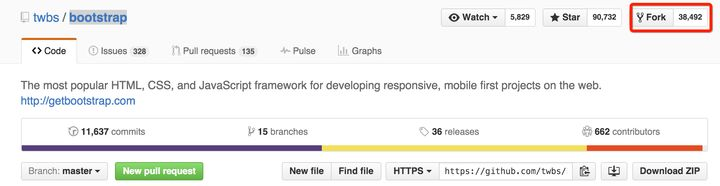
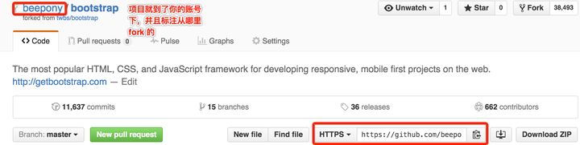

### 当你想更正别人仓库里的错误时，要走一个流程：
1. 先 fork 别人的仓库，相当于拷贝一份，相信我，不会有人直接让你改修原仓库的clone 到本地分支
2. 做一些 bug fix发起 pull request 给原仓库，让他看到你修改的 bug
3. 原仓库 review 这个 bug，如果是正确的话，就会 merge 到他自己的项目中至此，整个 pull request 的过程就结束了

### 理解了 pull request 的含义和流程，具体操作也就简单了。
### 以 Github 排名最高的 https://github.com/twbs/bootstrap 为例说明

1. 先点击 fork 仓库，项目现在就在你的账号下了





2. 在你自己的机器上 git clone 这个仓库，切换分支（也可以在 master 下），做一些修改

```shell
$ git clone https://github.com/beepony/bootstrap.git
$ cd bootstrap
$ git checkout -b test-pr
$ git add . && git commit -m "test-pr"
$ git push origin test-pr
```

3. 完成修改之后，点击旁边 pull request 按钮, New pull request

4. 添加一些注释信息，确认提交

5. 仓库作者看到，你提的确实是对的，就会 merge，合并到他的项目中